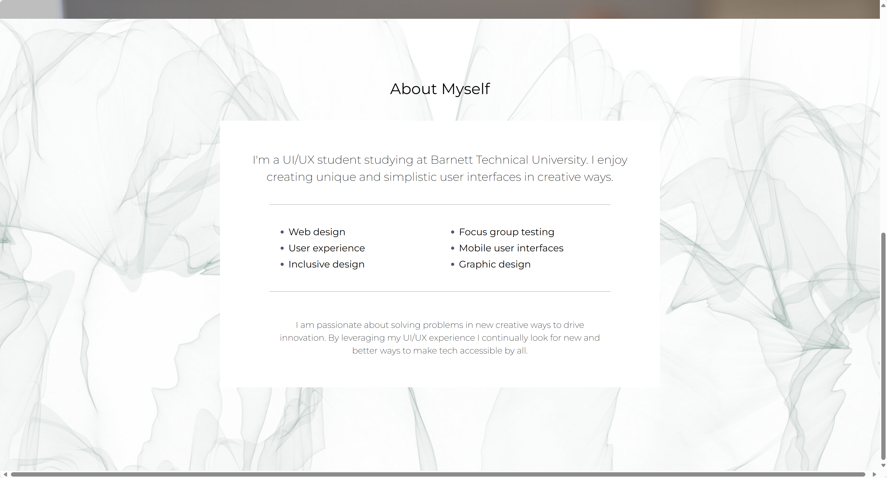

# Add `About` section

In this step, you will add a section called `About`. This section will contain information about yourself and your skills, and your favourite quotes.

OK. Let's get started!

## Step 0: Restore the Blazor WebAssembly project

If you haven't completed the previous step or want to start from the save point, run the following commands to restore the Blazor WebAssembly project.

```bash
cd $CODESPACE_VSCODE_FOLDER
mkdir -p workshop && cp -a workshop-docs/save-points/step-02/. workshop/
cd workshop
```

## Step 1: Add `About me` section to the `Home` component

We keep updating the `Home` component to include the `About me` section. We'll split all the section into each component later in this workshop.

1. Open `MyPortfolio/Pages/Home.razor` and add the content just above the `@code {` line:

    ```csharp
    </section>
    
    @* ⬇️⬇️⬇️ Add codes below ⬇️⬇️⬇️ *@
    
    <section class="light" id="about">
        @if (heroAboutMe is not null)
        {
            
        }
        <h2>About Myself</h2>
        <div style="background-color: white; width: 50%; padding: 4rem; margin: 3rem auto; text-align: center;">
        @if (aboutMe is null)
        {
            <p><em>Loading...</em></p>
        }
        else
        {
            <p class="large">@aboutMe.Description</p>
            <hr />
            <ul style="text-align: left; columns: 2; font-size: 1.25rem; margin: 2rem 3rem; gap: 3rem;">
            @foreach (var skill in aboutMe.Skills)
            {
                <li key="@skill">@skill</li>
            }
            </ul>
            <hr />
            <p style="padding: 1rem 3rem 0;">@aboutMe.DetailOrQuote</p>
        }
        </div>
    </section>
    
    @* ⬆️⬆️⬆️ Add codes above ⬆️⬆️⬆️ *@
    
    @code {
    ```

1. Update the `@code { ... }` block to handle this `About me` section. Replace the `@code { ... }` block with the following code:

    ```csharp
    @code {
        private SiteProperties? property;
        private HeroImage? heroHome;

        private AboutMe? aboutMe;
        private HeroImage? heroAboutMe;
    
        protected override async Task OnInitializedAsync()
        {
            property = await Http.GetFromJsonAsync<SiteProperties>("sample-data/siteproperties.json");
    
            var heros = await Http.GetFromJsonAsync<List<HeroImage>>("sample-data/heroimages.json");
            heroHome = heros.SingleOrDefault(h => h.Name == "home");

            aboutMe = await Http.GetFromJsonAsync<AboutMe>("sample-data/aboutme.json");
            heroAboutMe = heros.SingleOrDefault(h => h.Name == "about");
        }
    }
    ```

## Step 2: Add `aboutme.json`

The `aboutme.json` file are base data to display your information details. We will add these files to the `wwwroot/sample-data` directory.

1. Make sure you're in the `workshop` directory.

    ```bash
    cd $CODESPACE_VSCODE_FOLDER/workshop
    ```

1. Create both files in the `wwwroot/sample-data` directory by running the following commands or on the codespace workspace on the side.

    ```bash
    touch MyPortfolio/wwwroot/sample-data/aboutme.json
    ```

1. Open `aboutme.json` and add the following content:

    ```json
    {
      "description": "{{introduce-yourself}}",
      "skills": [
        "{{your-skills}}",
        "{{your-skills}}",
        "{{your-skills}}",
        "{{your-skills}}",
        "{{your-skills}}",
        "{{your-skills}}"
      ],
      "detailOrQuote": "{{tell-us-about-yourself}}"
    }
    ```

1. Open `heroimages.json` and replace the content with the following:

    ```json
    [
      {
        "name": "home",
        "src": "images/woman-with-tablet.jpg",
        "alt": "woman with glasses holding a tablet"
      },
      {
        "name": "about",
        "src": "images/motion-background.jpg",
        "alt": "gray abstract background"
      }
    ]
    ```

## Step 3: Add `AboutMe` class

Reading JSON data in Blazor is done by creating classes that represent the JSON data. We will create `AboutMe` class to represent the `aboutme.json` file.

1. Make sure you're in the `workshop` directory.

    ```bash
    cd $CODESPACE_VSCODE_FOLDER/workshop
    ```

1. Create both `AboutMe` class in the `Models` directory by running the following commands or on the codespace workspace on the side.

    ```bash
    mkdir -p $CODESPACE_VSCODE_FOLDER/workshop/MyPortfolio/Models
    touch MyPortfolio/Models/AboutMe.cs
    ```

1. Open `AboutMe.cs` and add the following content:

    ```csharp
    namespace MyPortfolio.Models;
    
    public class AboutMe
    {
        public string Description { get; set; } = string.Empty;
        public List<string> Skills { get; set; } = new();
        public string DetailOrQuote { get; set; } = string.Empty;
    }
    ```

## Step 4: Build and run the Blazor WebAssembly application

1. Make sure you're in the `workshop` directory.

    ```bash
    cd $CODESPACE_VSCODE_FOLDER/workshop
    ```

1. Build your Blazor WebAssembly project to make sure everything is working fine.

    ```bash
    dotnet build
    ```

1. Run the Blazor WebAssembly project to see the updated application on your web browser.

    ```bash
    dotnet watch run --project MyPortfolio
    ```

1. The updated application is open, and should look like below.

    

1. Stop the running application by pressing `Ctrl + C` (Windows) or `Cmd + C` (Mac) in the terminal.

---

Congratulations! You have added the `About` section in the `Home` component. In the next step, you will add a new section called `Portfolio`.

👉 [Step 4: Create a Portfolio component](./04-portfolio-component.md)
